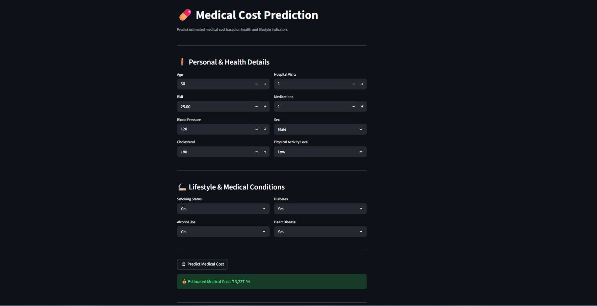

# 📊 Medical Cost Prediction using Linear Regression

## 📌 Project Overview
Healthcare expenses are influenced by multiple factors such as age, body condition, lifestyle habits, and existing medical conditions.  
This project focuses on building a **machine learning regression model** that can **estimate medical costs** based on these factors.

The project follows a **complete end-to-end machine learning pipeline**, starting from:
- understanding and exploring the dataset (EDA),
- preprocessing and feature handling,
- model training and evaluation,
- and finally deploying the trained model as an interactive **Streamlit web application**.

The goal is not only to build a predictive model, but also to demonstrate **real-world ML practices**, including clean project structure, pipeline usage, and deployment readiness.

---

## 🧠 Problem Statement
Medical cost prediction is an important problem in the healthcare domain, as it helps hospitals, insurance providers, and individuals estimate potential healthcare expenses in advance.

The challenge is to understand how various factors such as:
- age,
- BMI,
- blood pressure,
- cholesterol levels,
- lifestyle habits (smoking, alcohol use, physical activity),
- and medical conditions (diabetes, heart disease)

collectively impact the overall medical cost.

The objective of this project is to:
- analyze the relationship between these features and medical cost,
- build a regression model that can accurately predict medical expenses,
- and deploy the solution so that users can interact with it in real time.

---

## 📁 Project Structure

- **app.py** – Streamlit application  
- **model.pkl** – Trained machine learning model  
- **requirements.txt** – Project dependencies  
- **README.md** – Project documentation  

- **Notebooks/**
  - `01_EDA.ipynb` – Exploratory Data Analysis
  - `02_Model_Building.ipynb` – Model training and evaluation

- **screenshots/**
  - `app_preview.png` – Streamlit app preview

## 📊 Exploratory Data Analysis (EDA)
EDA is performed in `01_EDA.ipynb` and includes:
- Understanding dataset structure and data types
- Checking missing values and data quality
- Univariate analysis of numerical and categorical features
- Bivariate analysis to study feature–target relationships
- Correlation analysis to identify important predictors
- Key insights derived from visualizations

---

## 🧪 Model Building & Evaluation
Model building is performed in `02_Model_Building.ipynb` and includes:
- Data preprocessing using `ColumnTransformer`
- Handling missing values using imputers
- Feature scaling and categorical encoding
- Training a Linear Regression model
- Evaluating model performance using regression metrics
- Saving the final trained pipeline as `model.pkl`

---

## 🌐 Streamlit Web App
The Streamlit application allows users to:
- Input personal, lifestyle, and medical details
- Get an estimated medical cost prediction instantly
- Interact with a clean, simple, and user-friendly interface

### 📸 App Preview

---

## 🛠️ Technologies Used
- Python
- Pandas
- NumPy
- Matplotlib
- Seaborn
- Scikit-learn
- Streamlit

---

## ⚙️ How to Run Locally

1. Install required libraries  
pip install -r requirements.txt

2. Run the Streamlit app  
streamlit run app.py

---

## 📈 Key Learnings
- Applying exploratory data analysis to understand real-world data
- Building regression models using pipelines
- Proper handling of missing values and categorical features
- Deploying machine learning models using Streamlit
- Organizing a professional and interview-ready GitHub project

---

## 👤 Author
Lalit K  
Aspiring Data Analyst / Data Scientist 

